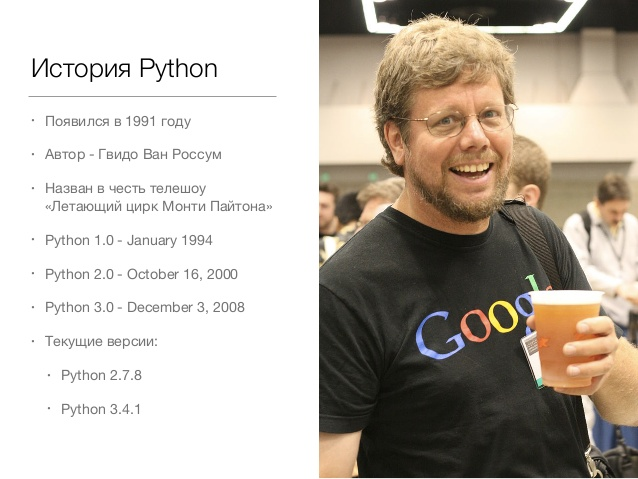

# Добро пожаловать на курсы от компании Fogstream
!!!
## О компании

!!!
## 10.10.10

!!!
## О курсе
- 3 секции
!!!
## О курсе
- 3 секции
- 2 этапа
!!!
## О курсе
- 3 секции
- 2 этапа
- 6 месяцев
!!!
## Введение в программирование на языке Python
!!!
## История языка

!!!
## Чем Python крут
 - Лаконичный и понятный
!!!
## Лаконичный и понятный
 ```python
 # Что делает эта функция?
 print('Hello world!')

 # А эта?
 len('Hello world!')

 # Тут еще сложнее
 sorted('Hello world!')
 ```
!!!
## Чем Python крут
- Лаконичный и понятный
- Универсальный
!!!
## Универсальный
!!!
## Области применения
- Веб
- Системы сбора и обработки данных
- Статистика и машинное обучение
- Роботы
- Автоматизация рутины
- Боты
- Desktop-приложения
- Много всего другого
!!!
## Чем Python крут
 - Лаконичный и понятный
 - Универсальный
 - Большое сообщество
!!!
## Большое сообщество
- Хорошая документация
!!!
## Большое сообщество
- Хорошая документация
- Много обучающего материала (курсы, митапы, статьи)
!!!
## Большое сообщество
- Хорошая документация
- Много обучающего материала (курсы, митапы, статьи)
- stackoverflow.com
!!!
## Большое сообщество
- Хорошая документация
- Много обучающего материала (курсы, митапы, статьи)
- stackoverflow.com

- Не бойтесь гуглить проблему!
!!!

## А также Python
- Интерпретируемый
!!!
## А также Python
- Интерпретируемый
- Динамический
!!!
## А также Python
- Интерпретируемый
- Динамический
- Мультипарадигменный
!!!
## Сложно?
!!!
## Интерпретируемый
!!!
## Динамический
```python
var = 1 # Интерпретатор понимает, что в переменная ссылается на число

var = 'Привет' # Ошибки никакой нет. WTF?
```
!!!
## Мультипарадигменный
- Процедурное программирование
!!!
## Мультипарадигменный
- Процедурное программирование
- Функциональное программирование
!!!
## Мультипарадигменный
- Процедурное программирование
- Функциональное программирование
- Объектно-ориентированное программирование
!!!
## Базовые типы данных в Python
- Числа
!!!
## Базовые типы данных в Python
- Числа
- Строки
!!!
## Базовые типы данных в Python
- Числа
- Строки
- Логические
!!!
## Базовые типы данных в Python
- Числа
- Строки
- Логические
- Последовательности
!!!
## Базовые типы данных в Python
- Числа
- Строки
- Логические
- Последовательности
- Файлы
!!!
## Числа
- Целые
!!!
## Числа
- Целые
- Вещественные
!!!
## Числа
- Целые
- Вещественные
- Комплексные
!!!
## Целые числа
```Python
a = 5
b = 10
```
!!!
## Вещественные числа
```Python
a = 3.14
b = 5.25
```
!!!
## Важно
```Python
a = 1
b = 1.0

a == b # ???
```
!!!
## Важно
```Python
a = 1
b = 1.0

a == b # True
```
!!!
## Комплексные числа
```Python
z = 1 + 2j

# Действительная часть
z.real

# Мнимая часть
z.imag
```
!!!
## Операции
"Числа - они и в Африке числа."(с) Цитаты великих людей
```Python
a = 5
b = 3.14

# Скадываем
a + b
```
!!!
## Операции
"Числа - они и в Африке числа."(с) Цитаты великих людей
```Python
a = 5
b = 3.14

# Скадываем
a + b # 8.14

# Отнимаем
a - b
```
!!!
## Операции
"Числа - они и в Африке числа."(с) Цитаты великих людей
```Python
a = 5
b = 3.14

# Скадываем
a + b # 8.14

# Отнимаем
a - b # 1.8599999999999999

# Умножаем
a * b
```
!!!
## Операции
"Числа - они и в Африке числа."(с) Цитаты великих людей
```Python
a = 5
b = 3.14

# Скадываем
a + b # 8.14

# Отнимаем
a - b # 1.8599999999999999

# Умножаем
a * b # 15.700000000000001

# Делим
a / b
```
!!!
## Операции
"Числа - они и в Африке числа."(с) Цитаты великих людей
```Python
a = 5
b = 3.14

# Скадываем
a + b # 8.14

# Отнимаем
a - b # 1.8599999999999999

# Умножаем
a * b # 15.700000000000001

# Делим
a / b # 1.592356687898089

# Возводим в степень
a ** 2
```
!!!
## Операции
"Числа - они и в Африке числа."(с) Цитаты великих людей
```Python
a = 5
b = 3.14

# Скадываем
a + b # 8.14

# Отнимаем
a - b # 1.8599999999999999

# Умножаем
a * b # 15.700000000000001

# Делим
a / b # 1.592356687898089

# Возводим в степень
a ** 2 # 25
```
!!!
## Можно сравнивать
```python
a == b # ???

a > b # ???

a <= b # ???
```
!!!
## Можно сравнивать
```python
a == b # False

a > b # True

a <= b # False
```
!!!
## Строки
```python
'строка'

"строка"

''' строка с
переносом  '''
```
!!!
## Операции со строками
```python
a = 'Fogstream'

# Получение символа по индексу
a[0] # 'F'

a[4] # 't'
```
!!!
## Срезы
```python
a[0:3] # 'Fog'
```
!!!
## Срезы
```python
a[0:3] # 'Fog'

a[:3] # Тоже самое
```
!!!
## Срезы
```python
a[0:3] # 'Fog'

a[:3] # Тоже самое

a[4:9] # 'tream'
```
!!!
## Срезы
```python
a[0:3] # 'Fog'

a[:3] # Тоже самое

a[4:9] # 'tream'

a[4:] # Можно и так
```
!!!
## Срезы
```python
a[-1] # Отрицательный индекс?!
```
!!!

!!!
## Срезы
```python
a[-1] # 'm'
```
!!!
## Еще о срезах
```python
a[start:end:step]
```
!!!
## Проверить дома
```python
a[1:3]

a[:4:2]

a[2::3]

a[::2]

a[::-1]

a[:]
```
!!!
## Срезы не измеют строку, а создают новую
```python
new_str = a[:-1]

print(new_str) # 'Fogstrea'

print(a) # 'Fogstream'
```
!!!
## Сложение строк
```python
b = 'Courses'

a + ' ' + b  # Fogstream Courses
```
!!!
## Важно
Строки не изменяемы
```python
a[0] = 'p' # ОШИБКА!!!
```
!!!
## Еще операции со строками
```python
'hello  '.strip()  # 'hello'

'hello world'.upper()  # 'HELLO WORLD'

len('hello')  # 5

'wor' in 'hello world'  # True (входит ли "wor" в строку "hello world")

'hello world'.startswith('hell')  # True (начинается ли  "hello world" c "hell")
```
!!!
## Последовательности
- Списки
!!!
## Последовательности
- Списки
- Кортежи
!!!
## Последовательности
- Списки
- Кортежи
- Словари
!!!
## Последовательности
- Списки
- Кортежи
- Словари
- Множества
!!!
## Последовательности
### О последовательностях на следующем занятии
!!!
## Резюмируем
- Изучили прелести Python
!!!
## Резюмируем
- Изучили прелести Python
- Посмотрели базовые типы
!!!
## Резюмируем
- Изучили прелести Python
- Посмотрели базовые типы
- Научились с ними работать
!!!
## Резюмируем
- Изучили прелести Python
- Посмотрели базовые типы
- Научились с ними работать
- ...
!!!
## Резюмируем
- Изучили прелести Python
- Посмотрели базовые типы
- Научились с ними работать
- ...
- PROFIT!
!!!
## Что дальше?
!!!
## Как эту магию запустить
- Установка Python3
```
sudo apt-get install python3
```
- Установка
[virtual environment](http://docs.python-guide.org/en/latest/dev/virtualenvs/#lower-level-virtualenv)

- Ставим текстовый редактор или IDE
```
PyCharm
или
Sublime Text
или
Atom
или
много чего другого
```
!!!
## Что лучше ставить?

!!!
## Спасибо за внимание!

!!!
## Вопросы
!!!
