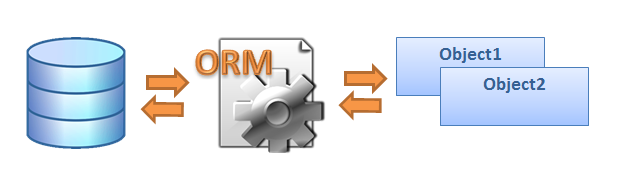

# Django ORM
!!!
## Django ORM и модели
!!!
## Что такое ORM?


!!!
## Что такое ORM?
- ORM - Object-relational mapping

!!!
## Что такое ORM?
- ORM - Объектно-реляционное отображение

!!!
## Что такое ORM?
- ORM - технология программирования, которая связывает базы данных с концепциями
объектно-ориентированных языков программирования.

!!!
## Что такое ORM?
- ORM - прослойка между базой данных и кодом который пишет программист,
которая позволяет созданые в программе объекты складывать/получать в/из бд.

!!!
## Парадигма «несоответствия»
- Объектные и реляционные модели не очень хорошо работают вместе.

!!!
## Принцип работы ORM
- Ключевой особенностью ORM является отображение,
которое используется для привязки объекта к его данным в БД.

!!!
## Принцип работы ORM
- ORM как бы создает «виртуальную» схему базы данных в памяти и
позволяет манипулировать данными уже на уровне объектов.

!!!
## Преимущества ORM
- нет необходимости в написании SQL

!!!
## Преимущества ORM
- нет необходимости в написании SQL (в идеале)

!!!
## Преимущества ORM
- нет необходимости в написании SQL (в идеале)
- генерируемый код ORM оптимизирован

!!!

## Преимущества ORM
- нет необходимости в написании SQL (в идеале)
- генерируемый код ORM оптимизирован

!!!

## Преимущества ORM
- нет необходимости в написании SQL (в идеале)
- генерируемый код ORM оптимизирован
- быстрое написание запросов

!!!
## НО!
- ORM - не серебрянная пуля

!!!
## Недостатки ORM
- потеря производительности

!!!
## ORM или не-ORM?

!!!
## ORM или не-ORM?
- все зависит от задачи =)

!!!
## Модели
- отображают информацию о данных
- содержат поля
- поведение данных

!!!

## Модели
- каждая модель это класс унаследованный от ```django.db.models.Model.```

!!!

## Модели
- каждая модель это класс унаследованный от ```django.db.models.Model.```
- атрибут модели представляет поле в базе данных.

!!!

## Модели
- каждая модель это класс унаследованный от ```django.db.models.Model.```
- атрибут модели представляет поле в базе данных.
- Django предоставляет автоматически созданное API для доступа к данным.

!!!
## Пример из документации
```python
from django.db import models

class Person(models.Model):
    first_name = models.CharField(max_length=30)
    last_name = models.CharField(max_length=30)
```
!!!
## Пример из документации
```
CREATE TABLE myapp_person (
    "id" serial NOT NULL PRIMARY KEY,
    "first_name" varchar(30) NOT NULL,
    "last_name" varchar(30) NOT NULL
);
```
!!!
## Содержание модели
- поля

!!!
## Содержание модели
- поля
- методы модели

!!!
## Содержание модели
- поля
- методы модели
- метаданные
- менеджеры модели

!!!
## Содержание модели
- поля
- методы модели
- метаданные

!!!
## Содержание модели
- поля (атрибуты класса)
- методы модели (методы экземпляра)
- метаданные
- менеджеры модели (методы класса)

!!!
## Связь моделей
- OneToOne
- OneToMany
- ManyToMany

!!!
## Наследование моделей
- абстрактная модель

!!!
## Наследование моделей
- абстрактная модель
- Multi-table наследование

!!!
## Наследование моделей
- Абстрактная модель
- Multi-table наследование
- Proxy-модели

!!!
## Миграции
Миграции - перенос изменений из модели на структуру БД

!!!
## Миграции
Миграции - система контроля версий для БД

!!!

## Команды
- ```makemigration```

!!!
## Команды
- ```makemigration```
- ```migrate```

!!!
## Команды
- ```makemigration```
- ```migrate```
- ```sqlmigration```

!!!
## Запросы
Результаты выборки объектов из БД - ```QuerySet```

!!!
## QuerySet
В терминах SQL, ```QuerySet``` - это оператор SELECT,
а фильтры - условия такие, как WHERE или LIMIT.

!!!
## Важно
- QuerySet получается в результате использования Manager'a
- Отфильтрованный QuerySet – уникален
- QuerySets – ленивы

!!!

## Практикуем

!!!
