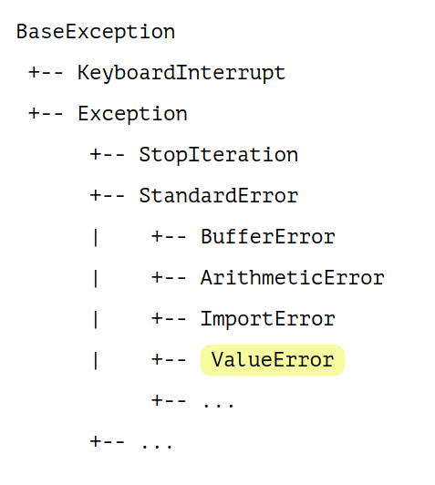

# Лекция 3
!!!

## Как мы делали
```Python
lst = input().split()
```
!!!

## Как мы делали
```Python
lst = input().split() # =(((
```
!!!

## Что спасет нас?!

!!!
## Файлы

!!!
# Файлы
Тестовые и бинарные файлы в Python - две большие разницы

!!!
# Файлы
Чтобы создать файл, воспользуемся оператором ```open```.

!!!
## Файлы
```Python
open('../examples/example1')
```
!!!
## Файлы
```Python
 # Один обязательный аргумент - путь до файла
open('./examples/example1')
```
!!!
## Файлы
```Python
 # Один обязательный аргумент - путь до файла
open('./examples/example1')
# <_io.TextIOWrapper name='./examples/example1' mode='r' encoding='UTF-8'>
```
!!!
## Аргументы функции open

!!!
## Аргументы функции open
- mode - определяет режим, в котором будет открыт файл

!!!
## Аргументы функции open
- mode - определяет режим, в котором будет открыт файл

- ```r```, ```w```, ```a```, ```+```
- ```b```, ```t```

!!!
## Аргументы функции open
- mode - определяет режим, в котором будет открыт файл
- для тестовых файлов можно указать ```encoding``` и ```errors```.

!!!
## Операции с файлами
Открыть бинарный файл для чтения:
```Python
open('./examples/csc.db', 'r+b')
```
!!!

## Операции с файлами
Открыть бинарный файл для чтения:
```Python
open('./examples/csc.db', 'r+b')
# <_io.BufferedRandom name='./csc.db'>
```
!!!
## Операции с файлами
Открыть текстовый файл в кодировке 'cp1251' для добавления, игнорируя ошибки:
```Python
open('./examples/example1', 'a', encoding='cp1251', errors='ignore')
```
!!!
## Операции с файлами
Открыть текстовый файл в кодировке 'cp1251' для добавления, игнорируя ошибки:
```Python
open('./examples/example1', 'a', encoding='cp1251', errors='ignore')
# <[...] name='./example1' mode='a' encoding='cp1251'>
```
!!!

## Операции с файлами
Создать новый текстовый файл в системной кодировке и
открыть его для записи:
```Python
open("./lecture4.tex", "x")
# <[...] name='./lecture4.tex' mode='x' encoding='UTF-8'>
```
!!!

## Атрибуты файлового объекта
```Python
my_file = open("some.txt", "w")

print("Имя файла: ", my_file.name)
print("Файл закрыт: ", my_file.closed)
print("В каком режиме файл открыт: ", my_file.mode)
print("Пробелы: ", my_file.softspace)
```
!!!

## Атрибуты файлового объекта
```Python
my_file = open("some.txt", "w")

print("Имя файла: ", my_file.name) # 'some.txt'
print("Файл закрыт: ", my_file.closed) # False
print("В каком режиме файл открыт: ", my_file.mode) # 'w'
```
!!!

## Закрытие файла
```Python
my_file.closed
```
!!!


## Закрытие файла
```Python
my_file.closed # False
```
!!!

## Закрытие файла
```Python
my_file.close()

my_file.closed # True
```
!!!
## Закрытие файла
Изменения в самом файле произойдут только после его закрытия!
!!!
## Чтение файлов
```Python
my_file = open('./examples/example1', 'r')

my_file.read(4)
```
!!!
## Чтение файлов
```Python
my_file = open('./examples/example1', 'r')

my_file.read(4) # 'Hey!'
```
!!!
## Чтение файлов
```Python
my_file = open('./examples/example1', 'r')

# Читаем строку
my_file.readline()
```
!!!
## Чтение файлов
```Python
my_file = open('./examples/example1', 'r')

# Читаем строку
my_file.readline() # 'Hey! What's up?!'
```
!!!
## Чтение файлов
```Python
my_file = open('./examples/example1', 'r')

# Читаем строки
my_file.readlines()
```
!!!

## Чтение файлов
```Python
my_file = open('./examples/example1', 'r')

# Читаем строки
my_file.readlines()
 #["Hey! What's up?!\n", '\n', 'Hey! Hey! What do you say?!\n']
```
!!!
## Запись в файл
```Python
handle = open('./examples/example2'. 'w')

handle.write('habrahabr')
```
!!!

## Запись в файл
```Python
handle = open('./examples/example2'. 'w')

handle.write('habrahabr')
# ???
```
!!!

## Запись в файл
```Python
handle = open('./examples/example2'. 'w')

handle.write('habrahabr')
# 9
```
!!!

## Запись в файл
```Python
handle = open('./examples/example2'. 'w')

handle.writelines(['habrahabr', 'super good'])
```
!!!
## Полезные методы работы с файлами
```Python
handle = open('./examples/example3', 'w')

handle.tell()
```
!!!
## Полезные методы работы с файлами
```Python
handle = open('./examples/example3', 'w')

handle.tell() # 0
```
!!!
## Полезные методы работы с файлами
```Python
handle.seek(8)

handle.tell()
```
!!!
## Полезные методы работы с файлами
```Python
handle.seek(8)

handle.tell() # 8
```
!!!

## Полезные методы работы с файлами
```Python
handle.write('abc')

handle.tell() # ???
```
!!!

## Полезные методы работы с файлами
```Python
handle.write('abc')

handle.tell() # 11
```
!!!
## Потоки ввода/вывода

!!!
## Потоки ввода/вывода
- ```sys.stdin```

!!!
## Потоки ввода/вывода
- ```sys.stdin```

```Python
input()
```
!!!
## Потоки ввода/вывода
- ```sys.stdout```

!!!

## Потоки ввода/вывода
- ```sys.stdout``` и ```sys.stderr```

```Python
print()
```
!!!

## Еще о функции ```print```
```Python
print('abc', file=handle)
```
!!!

## Библиотека io
```Python
import io
handle = io.StringIO("foo\n\bar")
handle.readline() #'foo\n'

handle.write("boo")
handle.getvalue() # 'foo\nboo'
```
!!!
## C файлами все!
Ура!
!!!
## Анекдот

!!!
## Анекдот
заходит как-то тестировщик в бар

забегает в бар

пролезает в бар

прыгает в бар

!!!

## Анекдот
заказывает себе кружку пива

два кружки пива

-1 кружку пива

9999999 кружек пива

ававав кружек пива
!!!

## К чему анекдот?
```Python
number = int(input())
```
!!!

## К чему анекдот?
```Python
number = int(input('abc'))
# ???
```
!!!
## К чему анекдот?
```Python
number = int(input('abc'))
# ValueError: invalid literal for int() with base 10: ''
```
!!!
## Исключения

!!!
## Исключения

!!!

## Исключения
```Python
try:
  number = int(input('abc'))
except ValueError:
  print ('Пожалуйста, не ломай мой код! Введи число')
```
!!!

## Исключения
```Python
try:
  # какой-то код
except Excetion:
  # как-то обрабатываем
```
!!!

## Исключения
```Python
try:
  # какой-то код
except Excetion: # =((((
  # как-то обрабатываем
```
!!!

## НИКОГДА ТАК НЕ ДЕЛАЙТЕ
```Python
try:
  # какой-то код
except Excetion: # =((((
  # как-то обрабатываем
```
!!!
## Почему?

!!!
## Почему?
Сейчас Егор расскажет анекдот
!!!
## Что еще делать с исключениями?
```Python
try:
  vk_client.get_friends(online=true)
except Exception as exception:
  print ('Что-то страшное случилось, вот проблема: {e}'.format(e=exception))
```
!!!
## Цепочки исключений
```Python
try:
  # тут что-то происходит
except ValueError:
  # как-то обрабатываем
except KeyError:
  # как-то обрабатываем
...
finally:
  # так называемый "Код уборки"
```

!!!
## Полезные советы

!!!

## Полезные советы
- покрывайте только неболшие участки кода

!!!

## Полезные советы
- покрывайте только неболшие участки кода
- не перехватывайте общие исключения

!!!

## Полезные советы
- покрывайте только неболшие участки кода
- не перехватывайте общие исключения
- можно выкидывать свои исключения

!!!

## Полезные советы
- покрывайте только неболшие участки кода
- не перехватывайте общие исключения
- можно выкидывать свои исключения

```Python
class MyException(Exception): pass

raise MyException('Мое исключение')
```
!!!

## Полезные советы
- покрывайте только неболшие участки кода
- не перехватывайте общие исключения
- можно выкидывать свои исключения
- ???
- PROFIT
!!!

## Оператор with
Порой мы забываем закрыть файл

!!!


## Оператор with
Порой мы забываем закрыть файл

Все мы люди
!!!

## Оператор with
```Python
"with" expression ["as" target] ("," expression ["as" target])* ":"
    suite
```
!!!

## Удобно работать с файлами
```Python
with open('newfile.txt', 'w', encoding='utf-8') as g:
    d = int(input())
    print('1 / {} = {}'.format(d, 1 / d), file=g)
```
!!!

## Что такое хороший код?

!!!

## Что такое хороший код?
- правильно работает

!!!

## Что такое хороший код?
- правильно работает
- безопасный

!!!

## Что такое хороший код?
- правильно работает
- безопасный
- понятен

!!!


## Что такое хороший код?
- правильно работает
- безопасный
- понятен
- протестирован

!!!

## Что такое хороший код?
- правильно работает
- безопасный
- понятен
- протестирован
- соответствуен общим стандартам

!!!

## Общие стандарты

!!!

## Общие стандарты
[PEP8](https://pythonworld.ru/osnovy/pep-8-rukovodstvo-po-napisaniyu-koda-na-python.html)

!!!

## Общие стандарты
- табы или пробелы?

!!!

## Общие стандарты
- 4 пробела

!!!


## Общие стандарты
- 4 пробела
- Максимальная длина строки?

!!!


## Общие стандарты
- 4 пробела
- Максимальная длина строки = 80 символов

!!!


## Общие стандарты
- 4 пробела
- Максимальная длина строки = 80 символов

!!!

## Пустые строки
- две между top-level function
- одна между методами класса
- внутри функции можно отделять одной строкой логические блоки

!!!

## Стиль именования
- ```snake_case``` - для переменных и функций
- ```CamelCase``` - для классов
- ```UPPER_TEXT_WITH_UNDERSCORE``` - для глобальных констант

!!!

## Стиль наименования
- название функции - глагол (что делает функция?)
- название переменных существительное
- название переменных аля списки, словари и прочее - множественное число

!!!

## Все!

