# Основы баз данных
!!!
## Основы баз данных
!!!
## Немного терминологии
Атрибут — свойство некоторой сущности. Часто называется полем таблицы.

Домен атрибута — множество допустимых значений, которые может принимать атрибут.

!!!
## Немного терминологии
Кортеж — конечное множество взаимосвязанных допустимых значений атрибутов, которые вместе описывают некоторую сущность (строка таблицы).

Отношение — конечное множество кортежей (таблица).

!!!
## Немного терминологии
Схема отношения — конечное множество атрибутов, определяющих некоторую сущность. Иными словами, это структура таблицы, состоящей из конкретного набора полей.

!!!
## Немного терминологии
Нормальная форма — требование, предъявляемое к структуре таблиц в теории реляционных баз данных для устранения из базы избыточных функциональных зависимостей между атрибутами (полями таблиц).

!!!
## Немного терминологии
Метод нормальных форм (НФ) состоит в сборе информации о объектах решения задачи в рамках одного отношения и последующей декомпозиции этого отношения на несколько взаимосвязанных отношений на основе процедур нормализации отношений.

!!!
## Цель нормализации
Исключить избыточное дублирование данных, которое является причиной аномалий, возникших при добавлении, редактировании и удалении кортежей(строк таблицы).

!!!
## Первая нормальная форма
Первая нормальная форма (1НФ) - это обычное отношение. Отношение в 1НФ обладает следующими свойствами:

В отношении нет одинаковых кортежей.
Кортежи не упорядочены.
Атрибуты не упорядочены.
Все значения атрибутов атомарны.

!!!
## Первая нормальная форма
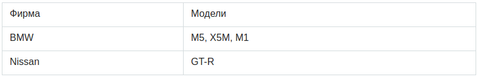

!!!
## Первая нормальная форма
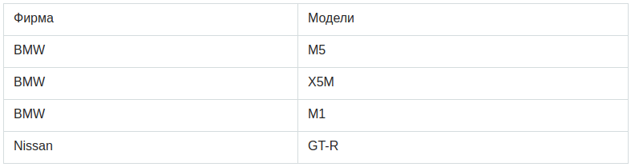

!!!
## Вторая нормальная форма
Отношение находится во 2НФ, если оно находится в 1НФ и каждый не ключевой атрибут зависит от выбраного ключа.
!!!
## Вторая нормальная форма
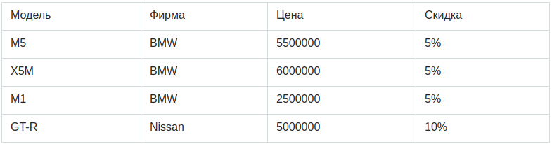

!!!
## Вторая нормальная форма
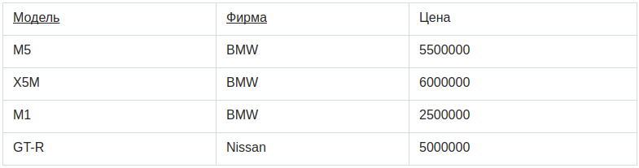

!!!
## Вторая нормальная форма
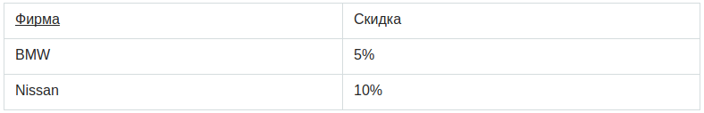

!!!
## Третья нормальная форма
Отношение находится в 3НФ, когда находится во 2НФ и и все неключевые атрибуты взаимно независимы.

!!!
## Третья нормальная форма
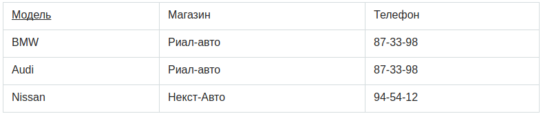

!!!
## Третья нормальная форма

| Магазин | Телефон |
| ------- | ------- |
| Риал-авто | 87-33-98 |
| Некст-Авто | 94-54-12 |

!!!
## Третья нормальная форма
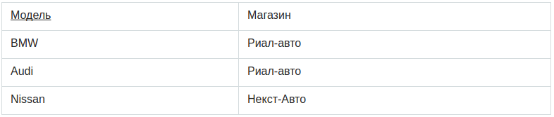

!!!
## Нормальная форма Бойса-Кодда (НФБК)
Определение 3НФ не совсем подходит для следующих отношений:
- отношение имеет две или более потенциальных ключа;
- два и более потенциальных ключа являются составными;
- они пересекаются, т.е. имеют хотя бы один общий атрибут.

!!!
## Нормальная форма Бойса-Кодда (НФБК)
Отношение  находится в нормальной форме Бойса-Кодда (НФБК) тогда и только тогда, когда значения всех функциональных зависимостей являются потенциальными ключами.

!!!
## Нормальная форма Бойса-Кодда (НФБК)
Предположим, рассматривается отношение, представляющее данные о бронировании стоянки на день

!!!
## Нормальная форма Бойса-Кодда (НФБК)
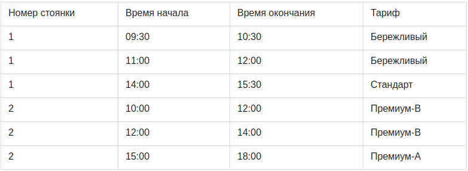

!!!
## Нормальная форма Бойса-Кодда (НФБК)
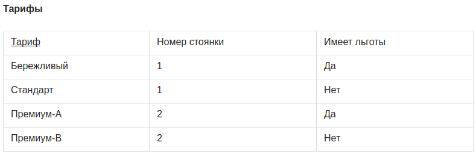

!!!
## Нормальная форма Бойса-Кодда (НФБК)
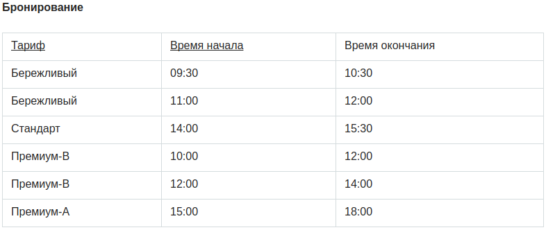

!!!
## Четвертая нормальная форма
Отношение находится в 4НФ, если оно находится в НФБК и все нетривиальные многозначные зависимости фактически являются функциональными зависимостями от ее потенциальных ключей.

!!!
## Четвертая нормальная форма
Предположим, что рестораны производят разные виды пиццы, а службы доставки ресторанов работают только в определенных районах города.

!!!
## Четвертая нормальная форма
Такая переменная отношения не соответствует 4НФ, так как существует следующая многозначная зависимость:

{Ресторан} → {Вид пиццы}

{Ресторан} → {Район доставки}

!!!
## Четвертая нормальная форма
Декомпозиция:
```
({Ресторан, Вид пиццы, Район доставки} → Цена)
```

!!!
## Пятая нормальная форма
Отношения находятся в 5НФ, если оно находится в 4НФ и отсутствуют сложные зависимые соединения между атрибутами.

Если «Атрибут зависит от «Атрибута_2», а «Атрибут_2» в свою очередь зависит от «Атрибута_3», а «Атрибут_3» зависит от «Атрибута_1», то все три атрибута обязательно входят в один кортеж.

!!!
## Шестая нормальная форма
Переменная находится в 6НФ тогда и только тогда, когда она неприводима, то есть не может быть подвергнута дальнейшей декомпозиции без потерь.

!!!
## Шестая нормальная форма
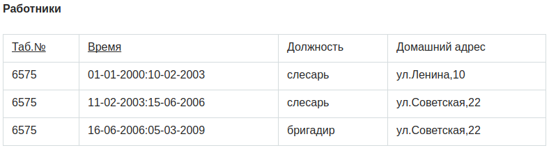

!!!
## Шестая нормальная форма
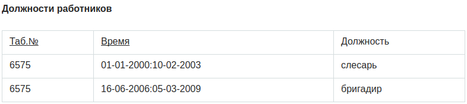

!!!
## Шестая нормальная форма
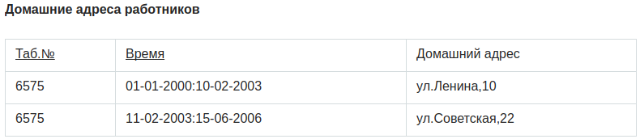

!!!
## Вопросы

!!!
## JOIN
- INNER
- LEFT
- RIGHT
- FULL OUTER JOIN
- CROSS JOIN
- Natural JOIN
- UPDATE JOIN

!!!
## JOIN
```
SELECT
  a.col1
  b.col1
FROM
  table1 AS a [INNER, LEFT, RIGHT ....] JOIN table2 AS b
  ON a.id = b.id [(AND|OR) condition....]
```
!!!
## INNER JOIN
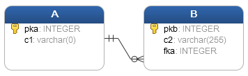

!!!
## INNER JOIN
```
SELECT
 A.pka,
 A.c1,
 B.pkb,
 B.c2
FROM
 A
INNER JOIN B ON A .pka = B.fka;
```

!!!
## INNER JOIN
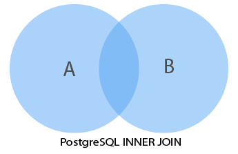

!!!
## Две таблицы
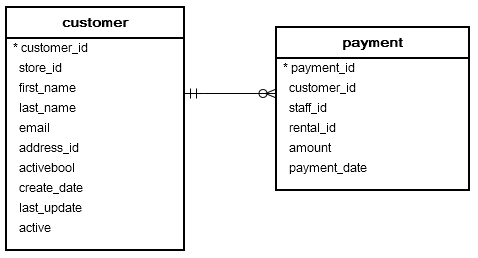

!!!
## Две таблицы
```
SELECT
 customer.customer_id,
 first_name,
 last_name,
 email,
 amount,
 payment_date
FROM
 customer
INNER JOIN payment ON payment.customer_id = customer.customer_id;
```
!!!
## Три таблицы
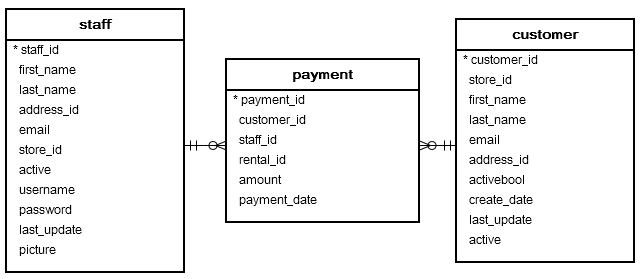

!!!
## Три таблицы
```
SELECT
 customer.customer_id,
 customer.first_name customer_first_name,
 customer.last_name customer_last_name,
 customer.email,
 staff.first_name staff_first_name,
 staff.last_name staff_last_name,
 amount,
 payment_date
FROM
 customer
INNER JOIN payment ON payment.customer_id = customer.customer_id
INNER JOIN staff ON payment.staff_id = staff.staff_id;
```

!!!
## LEFT
```
SELECT
 A.pka,
 A.c1,
 B.pkb,
 B.c2
FROM
 A
LEFT JOIN B ON A .pka = B.fka;
```
!!!
## LEFT
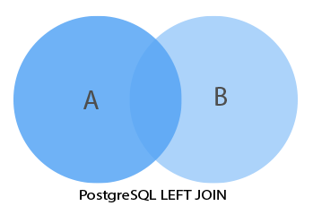

!!!
## LEFT
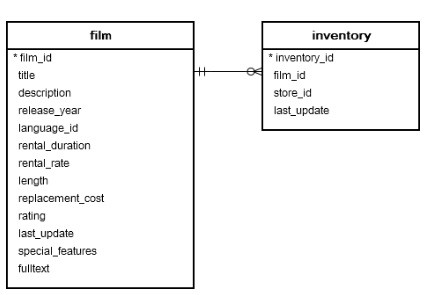

!!!
## LEFT
```
SELECT
 film.film_id,
 film.title,
 inventory_id
FROM
 film
LEFT JOIN inventory ON inventory.film_id = film.film_id;
```
!!!
## RIGHT
То же что и LEFT, только RIGHT

!!!
## FULL OUTER
```
SELECT * FROM A
FULL [OUTER] JOIN B on A.id = B.id;
```
!!!
## FULL OUTER
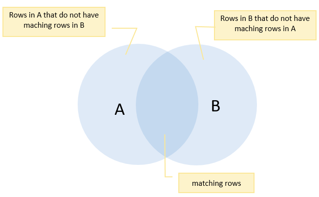

!!!
## FULL OUTER
```
# SELECT * FROM departments;
 department_id | department_name
---------------+-----------------
             1 | Sales
             2 | Marketing
             3 | HR
             4 | IT
             5 | Production
(5 rows)
```
!!!
## FULL OUTER
```
# SELECT * FROM employees;
 employee_id |  employee_name  | department_id
-------------+-----------------+---------------
           1 | Bette Nicholson |             1
           2 | Christian Gable |             1
           3 | Joe Swank       |             2
           4 | Fred Costner    |             3
           5 | Sandra Kilmer   |             4
           6 | Julia Mcqueen   |
(6 rows)
```
!!!
## FULL OUTER
```
SELECT
 employee_name,
 department_name
FROM
 employees e
FULL OUTER JOIN departments d ON d.department_id = e.department_id;
```
!!!
## FULL OUTER
```
employee_name  | department_name
—---------------+---------------—
 Bette Nicholson | Sales
 Christian Gable | Sales
 Joe Swank       | Marketing
 Fred Costner    | HR
 Sandra Kilmer   | IT
 Julia Mcqueen   | NULL
 NULL            | Production
```
!!!
## CROSS
```
CREATE TABLE T1 (label CHAR(1) PRIMARY KEY);

CREATE TABLE T2 (score INT PRIMARY KEY);

```
!!!
## CROSS
```
INSERT INTO T1 (label)
VALUES
 ('A'),
 ('B');

INSERT INTO T2 (score)
VALUES
 (1),
 (2),
 (3);
```
!!!
## CROSS
```
SELECT
 *
FROM
 T1
CROSS JOIN T2;
```
!!!
## CROSS
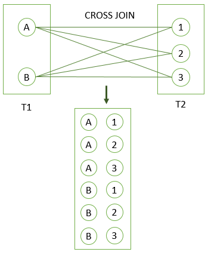

!!!
## CROSS
Тоже самое
```
SELECT *
FROM T1, T2;
```
```
SELECT *
FROM T1
INNER JOIN T2 ON TRUE;
```
!!!

## NATURAL
```
SELECT *
FROM T1
NATURAL [INNER, LEFT, RIGHT] JOIN T2;
```
!!!
## NATURAL
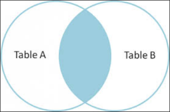

!!!
## NATURAL
```
CREATE TABLE categories (
 category_id serial PRIMARY KEY,
 category_name VARCHAR (255) NOT NULL
);

CREATE TABLE products (
 product_id serial PRIMARY KEY,
 product_name VARCHAR (255) NOT NULL,
 category_id INT NOT NULL,
 FOREIGN KEY (category_id) REFERENCES category (category_id)
);
```
!!!
## NATURAL
```
SELECT
 *
FROM
 products
NATURAL JOIN categories;
```
!!!
## NATURAL
```
category_id | product_id |  product_name   | category_name
-------------+------------+-----------------+---------------
           1 |          1 | iPhone          | Smart Phone
           1 |          2 | Samsung Galaxy  | Smart Phone
           2 |          3 | HP Elite        | Laptop
           2 |          4 | Lenovo Thinkpad | Laptop
           3 |          5 | iPad            | Tablet
           3 |          6 | Kindle Fire     | Tablet
(6 rows)
```
!!!
## UPDATE JOIN
```
UPDATE A
SET A.c1 = expresion
FROM B
WHERE A.c2 = B.c2;
```
!!!

## UPDATE JOIN
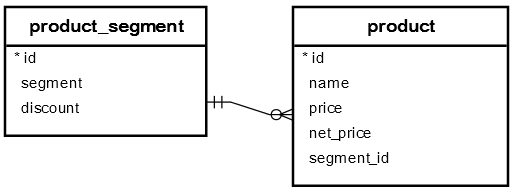

!!!
## UPDATE JOIN
```
UPDATE product
SET net_price = price - price * discount
FROM
product_segment
WHERE
product.segment_id = product_segment.id;

```
!!!
## Вопросы

!!!
## ORDER BY
```
SELECT
 column_1,
 column_2
FROM
 tbl_name
ORDER BY
 column_1 ASC,
 column_2 DESC;
```

!!!
## ORDER BY
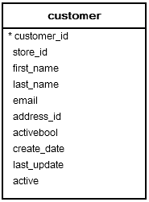

!!!
## ORDER BY
```
SELECT
 first_name,
 last_name
FROM
 customer
ORDER BY
 first_name ASC,
 last_name DESC;
 ```

!!!
## ORDER BY


!!!

## Виды агрегатных функции
- Агрегатные функции общего назначения (min, max, avg, ...)
- Агрегатные функции для статистических вычислений (corr, regr_avg, regr_syy, ...)
- Сортирующие агрегатные функции(mode, percentile_cont, ...)
- Гипотезирующие агрегатные функции (rank, dense, ...)
- Операции группировки ( grouping )

!!!
## Агрегатные функции
```
SELECT count(*) FROM sometable;
```
!!!
## Пример
```
SELECT * FROM items_sold;
 make  | model | sales
-------+-------+-------
 Foo   | GT    |  10
 Foo   | Tour  |  20
 Bar   | City  |  15
 Bar   | Sport |  5
(4 rows)
```
!!!
## Пример
```
SELECT make, model, GROUPING(make,model), sum(sales) FROM items_sold GROUP BY ROLLUP(make,model);
 make  | model | grouping | sum
-------+-------+----------+-----
 Foo   | GT    |        0 | 10
 Foo   | Tour  |        0 | 20
 Bar   | City  |        0 | 15
 Bar   | Sport |        0 | 5
 Foo   |       |        1 | 30
 Bar   |       |        1 | 20
       |       |        3 | 50
(7 rows)
```
!!!
## GROUP BY
```
SELECT column_1, aggregate_function(column_2)
FROM tbl_name
GROUP BY column_1;
```
!!!
## GROUP BY
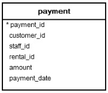

!!!
## Пример
```
SELECT
 customer_id,
 SUM (amount)
FROM
 payment
GROUP BY
 customer_id;
 ```
!!!
## Пример GROUP BY и ORDER BY
```
SELECT
 customer_id,
 SUM (amount)
FROM
 payment
GROUP BY
 customer_id
ORDER BY
 SUM (amount) DESC;
 ```
!!!
## HAVING
```
SELECT
 column_1,
 aggregate_function (column_2)
FROM
 tbl_name
GROUP BY
 column_1
HAVING
 condition;
 ```
!!!
## HAVING
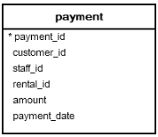

!!!
## HAVING
```
SELECT
 customer_id,
 SUM (amount)
FROM
 payment
GROUP BY
 customer_id
HAVING
 SUM (amount) > 200;
```
!!!
## Вопросы

!!!
## Операции объединения
- UNION
- INTERSECT
- EXCEPT

!!!
## UNION
```
SELECT
 column_1,
 column_2
FROM
 tbl_name_1
UNION
SELECT
 column_1,
 column_2
FROM
 tbl_name_2;
```
!!!
## UNION
```
SELECT *
FROM
 sales2007q1
UNION
SELECT *
FROM
 sales2007q2;
```
!!!
## UNION ALL
```
SELECT *
FROM
 sales2007q1
UNION ALL
SELECT *
FROM
 sales2007q2;
```
!!!
## INTERSECT
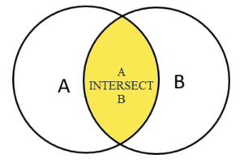

!!!
## INTERSECT
```
SELECT
 column_list
FROM
 A
INTERSECT
SELECT
 column_list
FROM
 B;
```
!!!
## Пример
```
CREATE TABLE employees (
 employee_id serial PRIMARY KEY,
 employee_name VARCHAR (255) NOT NULL
);

CREATE TABLE keys (
 employee_id INT PRIMARY KEY,
 effective_date DATE NOT NULL,
 FOREIGN KEY (employee_id) REFERENCES employees (employee_id)
);

CREATE TABLE hipos (
 employee_id INT PRIMARY KEY,
 effective_date DATE NOT NULL,
 FOREIGN KEY (employee_id) REFERENCES employees (employee_id)
);
```
!!!
## Пример
```
SELECT
 employee_id
FROM
 keys
INTERSECT
SELECT
        employee_id
FROM
 hipos;
```
!!!
## Пример
```
employee_id
-------------
           5
           2
(2 rows)
```
!!!
## EXPECT


!!!
## EXPECT
```
SELECT column_list
FROM A
WHERE condition_a
EXCEPT
SELECT column_list
FROM B
WHERE condition_b;
```
!!!
## Пример c INNER JOIN
```
SELECT
 distinct inventory.film_id,
 title
FROM
 inventory
INNER JOIN film ON film.film_id = inventory.film_id
ORDER BY title;
```
!!!
## Пример с EXPECT
```
SELECT
 film_id,
 title
FROM
 film
EXCEPT
 SELECT
 DISTINCT inventory.film_id,
 title
 FROM
 inventory
 INNER JOIN film ON film.film_id = inventory.film_id
```
!!!
## Вопросы

!!!
