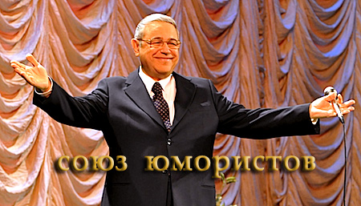
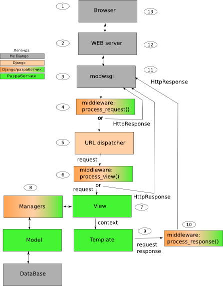
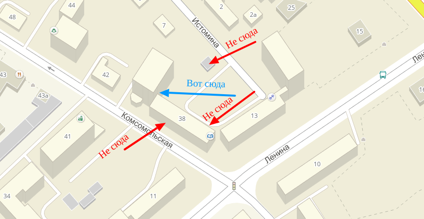

# Django
!!!
## Django Unchained


!!!
## Django ~~Unchained~~


!!!
## Django
- Фреймворк

!!!
## Django
- Фреймворк
- MVC

!!!
## Django
- Фреймворк
- MVC
- Python

!!!
## Django
- **Фреймворк**
- MVC
- Python

!!!
## Фреймворк
- Фреймворк != Библиотека

!!!
## Фреймворк
- Библиотека -- набор функций
- Фреймворк -- ~~какрас~~ каркас, задающий, кроме функций, правила организации кода

!!!
## Фреймворк
«Фреймворк» определяется как множество конкретных и абстрактных классов, а также определений способов их взаимоотношения.

!!!
## Известные фреймворки
- PHP (Yii, Zend, Symfony)
- JS (Node.JS, Angular, Backbone.js)
- HTML/CSS (Bootstrap, Foundation)
- Ruby (Ruby on Rails)
- C# (.NET Framework)
- C++ (Twisted Framework)
- Python (Django, Flask, Tornado)

!!!
## Три стула
- написание исходного кода с нуля
- использование фреймворков
- установка готовой CMS

!!!
## Важно
[Фреймворк - не серебрянная пуля](https://habrahabr.ru/post/253297/)

!!!
## Django
- Фреймворк
- **MVC**
- Python

!!!
## MVC
- Model
- View
- Controller

!!!
## MVC (по-русски)
- Модель
- Представление
- Контроллер

!!!
## MVC (по-человечески)
- Данные и методы работы с ними
- Отображение информации
- Связь между данными и отображением

!!!
## MVC (для самых маленьких)


!!!
## MVC в вебе
- БД или ORM
- HTML/CSS
- Python/Java/PHP/C#

!!!
## MVC в вебе для нас
- **ORM**
- HTML/CSS
- Python

!!!
## ORM
```
SELECT * FROM users WHERE login='egpro';
```
!!!
## ORM
```
engine.execute (
  "SELECT * FROM users WHERE login='egpro';"
)
```
!!!
## ORM
```
users = engine.execute (
  "SELECT * FROM users WHERE login='egpro';"
).fetchall()
```
!!!
## ORM
```python
def get_users(login):
    return engine.execute (
        "SELECT * FROM users WHERE login='{login}';".format(login=login)
    ).fetchall()
```
!!!
## ORM
```python
def get_users(login, only_active=False):
    query = "SELECT * FROM users WHERE login=?"
    if only_active:
        query += " AND is_active"
    return engine.execute(query, login).fetchall()
```
!!!
## ORM
```python
def get_users(login, only_active=False):
    users = User.filter(login=login)
    if only_active:
        users = users.active
    return users
```
!!!
## Django
- Фреймворк
- MVC
- Python

!!!
## Django
- Open-source
- Отличная документация
- Django ORM
- MTV
- Генерируемая админка
- Высокая скорость работы
- PYTHON ONE LOVE <3

!!!
## Не без минусов
- Монолитный
- Базируется на Django ORM

!!!
## Не без минусов
- Монолитный
- Базируется на Django ORM
- Мы очень любим Django, поэтому ругать не будем

!!!
## Django в картинках
!

!!!
## А теперь потрогаем Django


!!!

## Белый фон

!!!

## Кстати да, это карта

!!!
