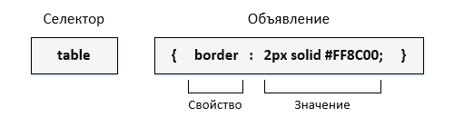

#  Основы верстки: HTML/CSS, JS
!!!
## ХТМЛ/ЦСС, ДжиЭс
!!!
## Что такое веб страница?

!!!
## Что такое веб страница?
Правильно!

!!!
## Что такое веб страница?
Правильно! Это документ с разметкой и стилями...

!!!
## Что такое веб страница?
Правильно! Это документ с разметкой и стилями... и скриптами

!!!
## Что такое веб страница?
Правильно! Это HTML-документ и CSS... и JS

!!!
## Роли
- HTML -- каркас документа
- CSS -- оформление  
- JS -- поведение (анимашки всякие)

!!!
## HTML
Язык гипертекста

!!!
## HTML
Язык гипертекста -- ???

!!!
## HTML
Язык гипертекста -- текст с ссылочками

!!!
## HTML
```html
<!DOCTYPE html>

<html lang="en">
<head>
    <meta charset="UTF-8">
    <title>Заголовок</title>
</head>
<body>
  <h1>Заголовок</h1>
  <!-- Комментарий -->
  <p>Первый абзац.</p>
  <p>Второй абзац.</p>
</body>
</html>
```
!!!
## DOM
- Document Object Model

!!!
## DOM


!!!
## Тэги
- ```<тег атрибут1="значение" атрибут2="значение">```
- ```<тег атрибут1="значение" атрибут2="значение">...</тег>```

!!!
## Виды тэгов
- теги верхнего уровня;
- теги заголовка документа;
- блочные элементы;
- строчные элементы;
- универсальные элементы;
- списки;
- таблицы;
- фреймы.

!!!

## Атрибут style
- У каждого тэга есть такой атрибут

!!!

## Атрибут style
- У каждого тэга есть такой атрибут
- Позволяет задавать оформление (цвет текста, фон, размер шрифта и т.д.)

!!!
## Атрибут style
```html
<p style="font-size: 24px;">
  Здесь написан всякий текст <span style="font-weight: bold">жирный</span>, например.
  Или <span style="color: orange; background-color: green;">
    оранжевый с зеленым фоном
  </span>,
  или <span style="color: violet;text-decoration: underline;">
    Фиолетовый с нижним подчеркиванием
  </span>.
</p>
```
!!!
## CSS
- Cascading Style Sheets

!!!
## CSS
- набор параметров форматирования

!!!
## Преимущества
- Разграничение кода и оформления
- Разное оформление для разных устройств
- Расширенные по сравнению с HTML способы оформления элементов
- Ускорение загрузки сайта
- Единое стилевое оформление множества документов
- Централизованное хранение

!!!
## Базовое понятие CSS
- Селектор — это некоторое имя стиля, для которого добавляются параметры форматирования

!!!
## Базовое понятие CSS
- Селектор — это некоторое имя стиля, для которого добавляются параметры форматирования
- В качестве селектора выступают теги, классы и идентификаторы.

!!!
## Синтаксис селекторов


!!!
## Виды селекторов
- Селекторы тегов
- Классы
- Идентификаторы
- Контекстные селекторы
- Соседние селекторы
- Дочерние селекторы
- Селекторы атрибутов
- Универсальный селектор

!!!
## Селекторы тегов
- Определяются для всех типов селекторов

```CSS
Тег { свойство1: значение; свойство2: значение; ... }
```
!!!
## Классы
- Опеределяются у всех тэгов, у которых опеределен атрибут class с таким именем
```CSS
.Имя класса { свойство1: значение; свойство2: значение; ... }
```

!!!
## Классный пример
```CSS
.red-with-bold { color: red; font-weight: bold;}
```
```HTML
<p class="red-with-bold"> Какой-то странный текст </p>
```
!!!
## Идентификаторы
- Похожи на класс, но определяют уникальное имя элемента

```CSS
#Имя идентификатора { свойство1: значение; свойство2: значение; ... }
```
!!!
## Пример
```CSS
#unique-element {font-size: 50px}

```
```HTML
<p>
  Очередной набор текста типо с
<span id='unique-element'> уникальным </span> элементом.
</p>
```
!!!
## Пример
- Недопустимо! только один тег может быть с таким id
```HTML
<p id='unique-element'>
  Очередной набор текста типо с
<span id='unique-element'> уникальным </span> элементом.
</p>
```
!!!
## Контестные селекторы
- Определяет стиль элемента в контесте другого
```HTML
<Тег1>
 <Тег2> ... </Тег2>
</Тег1>
```
```CSS
Тег1 Тег2 { ... }
```
!!!
## Соседние селекторы
- Только для элементов, которые следуют друг за другом

```CSS
Селектор 1 + Селектор 2 { Описание правил стиля }
```
!!!
## Соседние селекторы и пример
```HTML
<p>Lorem <b>ipsum </b> dolor sit amet, <i>consectetuer</i> adipiscing elit.</p>
<p>Lorem ipsum dolor sit amet, <i>consectetuer</i> adipiscing elit.</p>
```

!!!
## Соседние селекторы и пример
- Какие из них соседи?

!!!
## Соседние селекторы и пример
```CSS
b + i {color: red}
```
!!!
## Дочерние селекторы
- Элемент, который непосредственно располагается внутри родительского элемента

```CSS
Селектор 1 > Селектор 2 { Описание правил стиля }

```
!!!
## Дочерние и контекстые
- Дочерний селектор - прямым потомком
- Контестный селектор - может быть на любом уровне вложенности

!!!
## Универсальный селектор
- Применяется для всех элементов сразу
```CSS
* { Описание правил стиля }
```
!!!
## Наследование стилей
- Для дочерних элементов -- перенос правил от родителя к дочерним

!!!
## Группировка
- Можно группировать селекторы по стилям

!!!
## Было
```CSS
h1 {
  font-size: 12px;
  color: red;
}
h2 {
  font-size: 12px;
  color: black;
  text-decoration: underline;
}
h3 {
  font-size: 12px;
  color: green;
  text-decoration: underline;
  letter-spacing: 2px;
}
```
!!!
## Стало
```CSS
h1, h2, h3 {
  font-size: 12px;
}
h2, h3 {
  text-decoration: underline;
}
h1 {
  color: red;
}
h2 {
  color: black;
}
h3 {
  color: green;
  letter-spacing: 2px;
}
```
!!!
## Каскадность
- Каскадность  -- правила перекрытия

!!!
## Каскадность
- Стиль браузера.
- Стиль автора.
- Стиль пользователя.
- Стиль автора с добавлением !important.
- Стиль пользователя с добавлением !important.

!!!
## Пример
```HTML
<div id="menu">
 <ul>
  <li>Первый</li>
  <li class="two">Второй</li>
  <li>Третий</li>
 </ul>
</div>
```

!!!
## И стили
```CSS
#menu ul li {
 color: green;
}
.two {
 color: red;
}
```
!!!
## Правило специфичности
- a -- количество id в селекторе
- b -- количество классов и псевдоклассов
- с -- количество селекторов тэга

!!!
## Суммарная специфичность
```
100a + 10b + 1c
```

!!!

## Разберем пример
```CSS
*              {} /* a=0 b=0 c=0 -> специфичность = 0   */
li             {} /* a=0 b=0 c=1 -> специфичность = 1   */
li:first-line  {} /* a=0 b=0 c=2 -> специфичность = 2   */
ul li          {} /* a=0 b=0 c=2 -> специфичность = 2   */
ul ol+li       {} /* a=0 b=0 c=3 -> специфичность = 3   */
ul li.red      {} /* a=0 b=1 c=2 -> специфичность = 12  */
li.red.level   {} /* a=0 b=2 c=1 -> специфичность = 21  */
#t34           {} /* a=1 b=0 c=0 -> специфичность = 100 */
#content #wrap {} /* a=2 b=0 c=0 -> специфичность = 200 */
```
!!!

## CSS-фреймворки
Упрощают жизнь

!!!
## Плюсы
- Кроссбраузерность
- Возможность создать корректный HTML макет даже не очень опытному специалисту
- Единообразие кода
- Увеличение скорости разработки

!!!
## Минусы
- Привязанность к стилю CSS библиотеки
- Избыточный код

!!!
## Типы
- Простые css-фреймворки;
- Web-components;
- Css-сетки;
- Комплексные css-фреймворки.

!!!
## Популярные
- Bootstrap
- Foundation
- Semantic UI

!!!
## Konec

!!!
