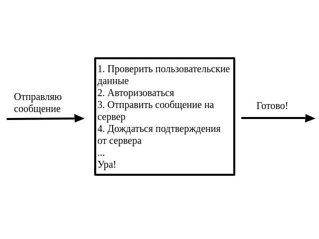
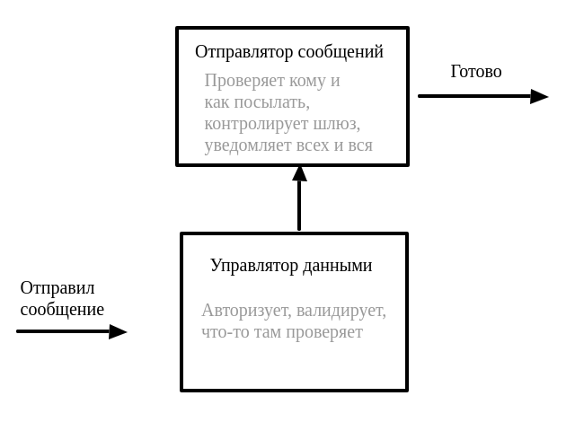
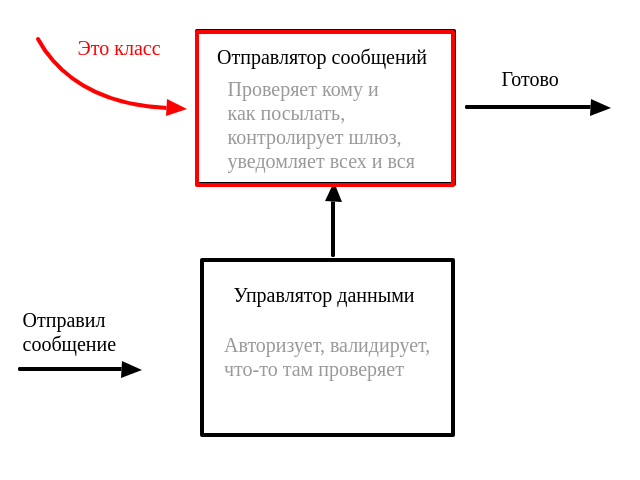
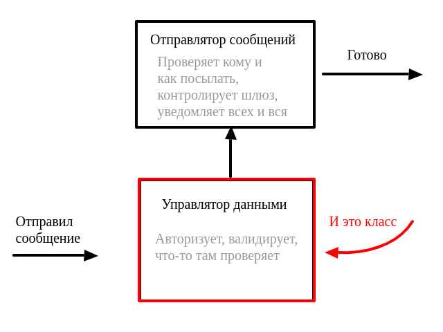

# ООП
!!!
## ООП
!!!
## ООП
- парадигма программирования, в которой основными концепциями являются понятия
объектов и классов.

!!!
## Задача
Я сделал задачу, хочу скинуть ссылку Егору в телеграмме.

!!!
## Решение

!!!
## Решение

!!!
## Решение

!!!
## Решение

!!!
## Решение

!!!
## Решение

!!!
## Решение
```python
class Sender:
  ...

class User:
  ...


def send_message_to_user(message):
    message.user.send_status_of_message(
        message,
        by_sender = Sender(),
    )
```
!!!

## Классы и объекты
!!!

## Классы и объекты
- *класс* - модель сущности
- *объект* - конкретная сущность заданного класса

!!!


## Классы и объекты
- *класс* - модель сущности

```python
class User:
    email = emailField()
    login = string(50)

```
!!!

## Классы и объекты
- *объект* - конкретная сущность заданного класса

```python
User(email='python_master3000@mail.ru', login='pythonmaster')

User(email='jsIsCool@rambler.ru', login='jsNinja')
```
!!!

## Другими словами
- *класс* - чертеж
- *объект* - конкретный объект по чертежу

!!!

## Создаем класс
```python
class Counter:

    def __init__(self, initial=0):
        self.value = initial

    def increment(self):
        self.value += 1

    def get(self):
      return self.value

```
!!!


## Создаем объект класса
```python
с = Counter(5)
c.increment()
c.get()
```
!!!

## Что, куда и как?

!!!

## Создаем класс
```python
class Counter:

    def __init__(self, initial=0): # Сначала срабатывает инициализация
        self.value = initial       # запись атрибута

    def increment(self):
        self.value += 1

    def get(self):
      return self.value            # чтение атрибута

```
!!!

## ```__init__``` - не констуктор
!!!

## ```__new__``` vs ```__init__```
- ```__new__``` создает пустой экземпляр класса
- ```__init__``` инициализирует его

!!!

## ```__new__``` vs ```__init__```
```python
class Noop:
    def __new__(cls, *args, **kwargs):
        print("Creating instance with {} and {}"
              .format(args, kwargs))
        instance = super().__new__(cls) # self
        return instance

    def __init__(self, *args, **kwargs):
        print("Initializing with {} and {}"
              .format(args, kwargs))

noop = Noop(42, attr="value")
# Creating instance with (42,) and {'attr': 'value'}
# Initializing with (42,) and {'attr': 'value'}
```
!!!

## Ключевое слово ```self```

В отличие от Java или C++ в Python нет магического слово "this".

Первый аргумент любого метода экземпляра - слово "self"

!!!

## Ключевое слово ```self```
Добавляем к экземпляру класса атрибут
```python
self.some_attribute = value
```
!!!

## Ключевое слово ```self```
```python
class A:

    def __init__(self, value):
      self.value = value

a = A(5)

a.value # 5

A.value # AttributeError: type object 'A' has no attribute 'value'
```
!!!

## Ключевое слово ```self```
```python
A(5).value # ???
```
!!!


## Ключевое слово ```self```
```python
A(5).value # 5
```
!!!

## Атрибуты класса и экземпляра

!!!

## Атрибуты класса и экземпляра
```python
class Counter:
    all_counters = []

    def __init__(self, initial=0):
        Counter.all_counters.append(self)
        #...
```
!!!

## Атрибуты класса и экземпляра
```python
Counter.all_counters # []

a = Counter()
b = Counter(5)

Counter.all_counters # ???
```
!!!

## Атрибуты класса и экземпляра
```python
Counter.all_counters # []

a = Counter()
b = Counter(5)

Counter.all_counters
# [<__main__.Counter object at ...>, <__main__.Counter object at ...>]
```
!!!

## Атрибуты класса и экземпляра
Можно задавать атрибуты классов прямым присваиванием
```python
Counter.some_attribute = 'Hey!'

Counter.some_attribute # 'Hey!'
```
!!!

## Соглашение об именовании атрибутов
В Python нет модификаторов классов

!!!

## Соглашение об именовании атрибутов
В Python нет модификаторов классов

Но есть договоренность

!!!


## Соглашение об именовании атрибутов
В Python нет модификаторов классов

Но есть договоренность, чисто по-братски

!!!


## Соглашение об именовании атрибутов
```python
class Noop:
    public_attribute = 42
    _private_attribute = [1, 2 ,3]

Noop.public_attribute # 42

Noop._private_attribute # ???
```
!!!


## Соглашение об именовании атрибутов
```python
class Noop:
    public_attribute = 42
    _private_attribute = [1, 2, 3]

Noop.public_attribute # 42

Noop._private_attribute # [1, 2, 3]
```
!!!

## Для особо ярых защитников атрибутов
```python
class Noop:
    __very_private_attribute = (1,)
```
!!!

## Для особо ярых защитников атрибутов
```python
class Noop:
    __very_private_attribute = (1,)

Noop.__very_private_attribute
# AttributeError: type object 'Noop' has no attribute [...]
```
!!!

## Внутренние атрибуты классов и экземпляров
```python
class Noob:
    """I'm empty class"""
```
!!!


## Внутренние атрибуты классов и экземпляров
```python
Noob.__doc__
# "I'm empty class"
Noob.__name__
# 'Noob'
Noob.__module__
# '__main__'
Noob.__dict__
# Тут описаны все внутренние метода и атрибуты класса
```
!!!


## Внутренние атрибуты классов и экземпляров
```python
noo = Noob()

noo.__dict__
# Тут описаны все внутренние метода и атрибуты экземпляра
```
!!!

## Наследование
```python
class Counter:
    def __init__(self, initial=0):
        self.value = initial

class OtherCounter(Counter):
    def get(self):
        return self.value
```
!!!

## Наследование
```python
c = OtherCounter()

c.get() # 0

c.value ## KeyError
```
!!!

## Наследование
Поиск имени атрибута или метода происходит в ```__dict__``` экземпляра. Если
нет таких имен, то ищет в классе, а затем рекурсивно по наследникам.

!!!

## Перегрузка методов
```python
class Counter:
    def __init__(self, initial=0):
        self.__class__.all_counters.append(self)
        self.value = initial

class OtherCounter(Counter):
    def __init__(self, initial=0):
        self.initial = initial
        super().__init__(initial)
```
!!!

## Перегрузка методов
```python
c = OtherCounter() # сначала __init__ у себя, затем __init__ у родителя
```
!!!

## Множественное наследование
```python
class A:
    def f(self):
        print('A.f')

class B:
    def f(self):
        print('B.f')

class C(A,B):
    pass
```
!!!

## Множественное наследование
```python
C().f() # ???
```
!!!

## Алгоритм С3
В случае множественного наследования Python использует алгоритм лианеризации C3
для определения метода, который нужно вызывать

!!!

## Алгоритм С3
Используем функцию классов ```mro()``` - Method Resolution Order
```python
C.mro()
# [<class '__main__.C'>, <class '__main__.A'>,
# <class '__main__.B'>, <class 'object'>]
```
!!!


## Множественное наследование
```python
C().f() # ???
```
!!!


## Множественное наследование
```python
C().f() # 'A.f'
```
!!!

## Магические методы

!!!

## Магические методы
"Магическими" методами называются внутренние методы классов, например, ```__init__```.

!!!

## Магические методы
С помощью магических методов можно:

- управлять к доступам атрибутов классов

!!!


## Магические методы
С помощью магических методов можно:

- управлять к доступам атрибутов классов
- перегружать операторы, например, сравнения или арифметические операторы

!!!


## Магические методы
С помощью магических методов можно:

- управлять к доступам атрибутов классов
- перегружать операторы, например, сравнения или арифметические операторы
- определить строковое представление экземпляра или метод его хэширования

!!!

## Методы ```__str__``` и ```__repr__```
```python
class Counter:
    def __init__(self, initial=0):
        self.value = initial

    def __repr__(self):
        return 'Счетчик({})'.format(self.value)

    def __str__(self):
        return 'Привет! Я Счетчик'

```
!!!

## Методы ```__str``` и ```__repr__```
```python
c = Counter(42)

c # 'Счетчик(42)'

print(c) # 'Привет! Я Счетчик'
```
!!!

## Метод ```__bool__```
```python
class Counter:
    def __init__(self, initial=0):
        self.value = initial

    def __bool__(self):
        return bool(self.value)

c = Counter()

if not c:
    print('No counts yet')
```
!!!

## Методы сравнения
```python
instance.__eq__(other) # instance == other
instance.__ne__(other) # instance != other
instance.__lt__(other) # instance < other
instance.__le__(other) # instance <= other
instance.__gt__(other) # instance > other
instance.__ge__(other) # instance >= other
```
!!!

## Метод ```__call__```
```python
class LikeFunction:
    def __init__(self, value):
        self.value = value

    def __call__(self):
        return self.value

func = LikeFunction(5)

func() # 5
```
!!!

## Все о магических методах
[Магия тут](https://docs.python.org/3/reference/datamodel.html#special-method-names)
