# Как устроен интернет

!!!
## Как устроен интернет

!!!
## Что такое интернет?

!!!
## Простая сеть
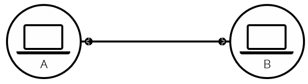

!!!
## Больше компов
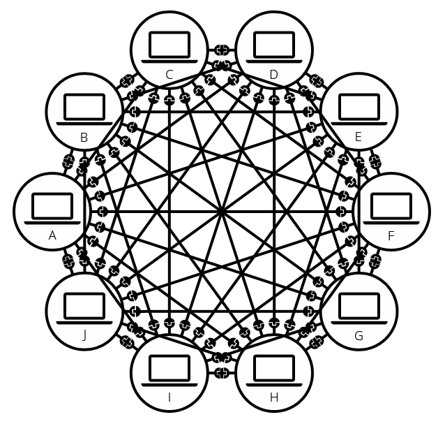

!!!
## Маршрутизатор
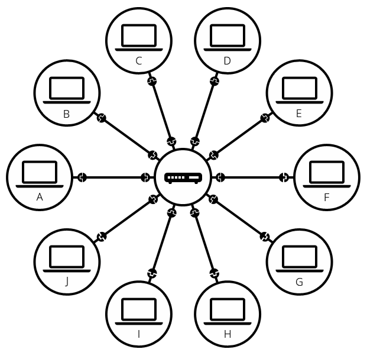

!!!
## Подсети
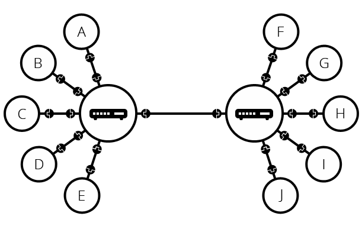

!!!
## Подсети


!!!
## Модем
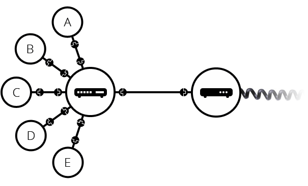

!!!
## Провайдер
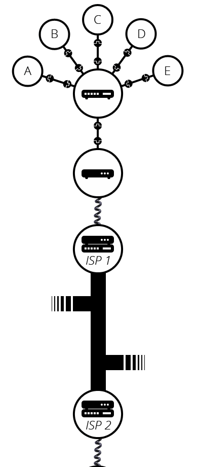

!!!
## Вывод
Интернет - это способ подключить компьютеры в единую сеть и убедиться, что даже
при серьезных сбоях, они все равно найдут способ связаться друг с другом.

!!!
## Интернет и веб
- Интернет —  это инфраструктура

!!!
## Интернет и веб
- Интернет —  это инфраструктура
- Веб — это сервис, построенный на основе этой инфраструктуры

!!!

## Другие сервисы
-Кроме Веба есть и другие сервисы, построенные на базе Интернета. Например, электронная почта или IRC.

!!!
## Поиск компьютера


!!!

## IP
- IPv4

!!!

## IP
- IPv4 (173.194.121.32)
- IPv6 (2027:0da8:8b73:0000:0000:8a2e:0370:1337)

!!!

## IP
Удобно

!!!

## IP
Удобно

Но нечитаемо.

!!!


## IP
Удобно

Но нечитаемо.

Как решить?

!!!

## Доменные имена
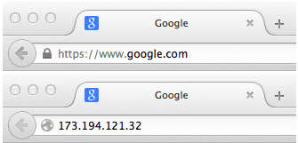

!!!

## Структура доменного имени
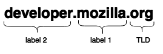

!!!

## Структура доменного имени
- TLD
- Домены

!!!

## Кто стоит за этим?
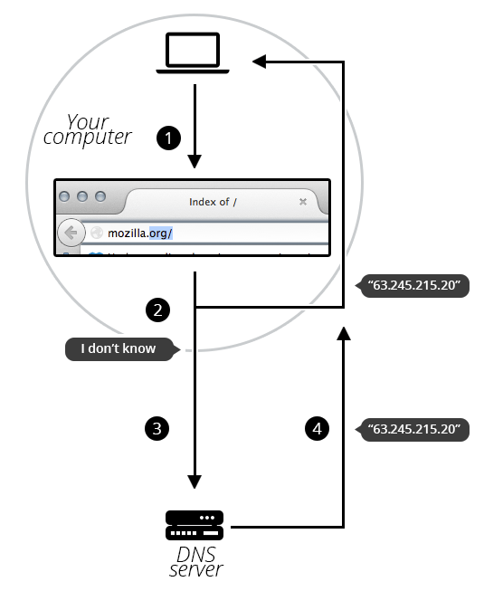

!!!

## Вернемся к вебу

!!!

## Клиенты и серверы
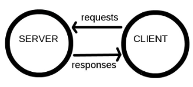

!!!

## Архитектура веба
- Интернет-подключение

!!!

## Архитектура веба
- Интернет-подключение
- DNS

!!!

## Архитектура веба
- Интернет-подключение
- DNS
- TCP/IP

!!!

## TCP
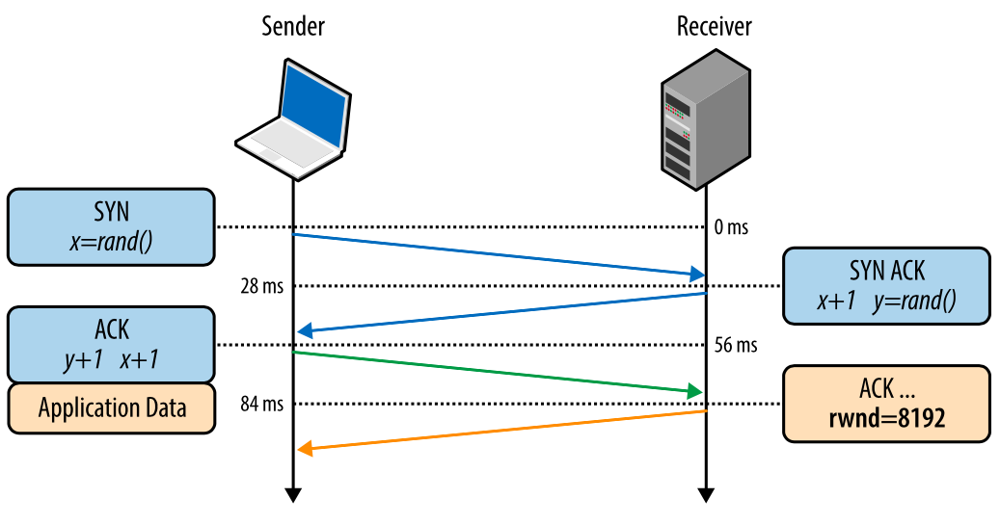

- SYN - синхронизация номеров последовательности
- ACK - поле «Номер подтверждения» задействовано
!!!

## TCP
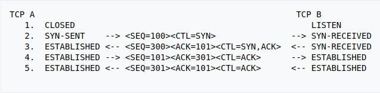

!!!

## Архитектура веба
- Интернет-подключение
- DNS
- TCP/IP
- HTTP

!!!

## Архитектура веба
- Интернет-подключение
- DNS
- TCP/IP
- HTTP
- Файлы компонентов

!!!

## Архитектура веба-приложения
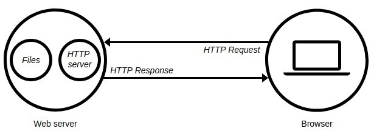

!!!

## Что такое веб-сервер?

!!!

## Что такое веб-сервер?
- Это железка

!!!


## Что такое веб-сервер?
- Это железка
- Это ПО

!!!

## Веб-сервера
- статические
- динамические

!!!

## Хороший сервак
- всегда работает
- стабильное подключение
- статичный IP

!!!

## Как общаться с сервером?
Хочу получить страницу. Что сказать?

!!!

## Как общаться с сервером?
Хочу получить страницу. Что сказать?

"Привет! Хочу получить страницу!"

!!!

## Как общаться с сервером?
Хочу получить страницу. Что сказать?
```
GET / HTTP/1.1
Host: www.yandex.ru
```
!!!

## Как общаться с сервером?
```
GET / HTTP/1.1
Host: www.yandex.ru
```
Что это? Немецкий?

!!!

## HTTP
- HTTP - Hypertext Transfer Protocol

!!!

## HTTP. Особенности
- текстовый

!!!

## HTTP. Особенности
- текстовый
- не хранит состояние

!!!

## HTTP. Особенности
- текстовый
- не хранит состояние
- сообщение состоит из: стартовая строка, заголовок, тело запроса

!!!


## HTTP
```
GET / HTTP/1.1
Host: www.yandex.ru
```

!!!

## HTTP-методы
- GET
- POST
- PUT
- HEAD
- DELETE
- И еще несколько
!!!

## HTTP/1.1
Версия протокола 1.1

!!!

## Что за палка между?
Что такое "/"?

!!!

## URL
URL - Uniform Resource Locator.

!!!

## URL
http://www.example.com:80/path/to/myfile.html?key1=value1&key2=value2#SomewhereInTheDocument


!!!

## О БОЖЕ, что это?

!!!

## Разберем URL
- http://
- www.example.com
- :80
- /path/to/myfile.html
- key1=value1 & key2=value2
- #SomewhereInTheDocument

!!!

## Абсолютные и относительные URL

!!!

## Ответ сервера
- Отправим запрос

```
GET / HTTP/1.1
Host: www.opera.com
Accept-Language: fr
User-Agent: BrowseAndDream/1.0
```
!!!


## Ответ сервера
- Получим ответ

```
HTTP/1.1 200 OK
Date: Fri, 24 Aug 2012, 13:56:44 GMT
```
!!!

## Коды ответа
- 1xx (Informational)
- 2xx (Successful)
- 3xx (Redirection)
- 4xx (Client Error)
- 5xx (Server Error)

!!!

## Немного попрактикуемся

!!!

## Библиотека Requests
```python
>>> r = requests.get('https://api.github.com/user', auth=('user', 'pass'))
>>> r.status_code
200
>>> r.headers['content-type']
'application/json; charset=utf8'
>>> r.encoding
'utf-8'
>>> r.text
u'{"type":"User"...'
>>> r.json()
{u'private_gists': 419, u'total_private_repos': 77, ...}
```
!!!
